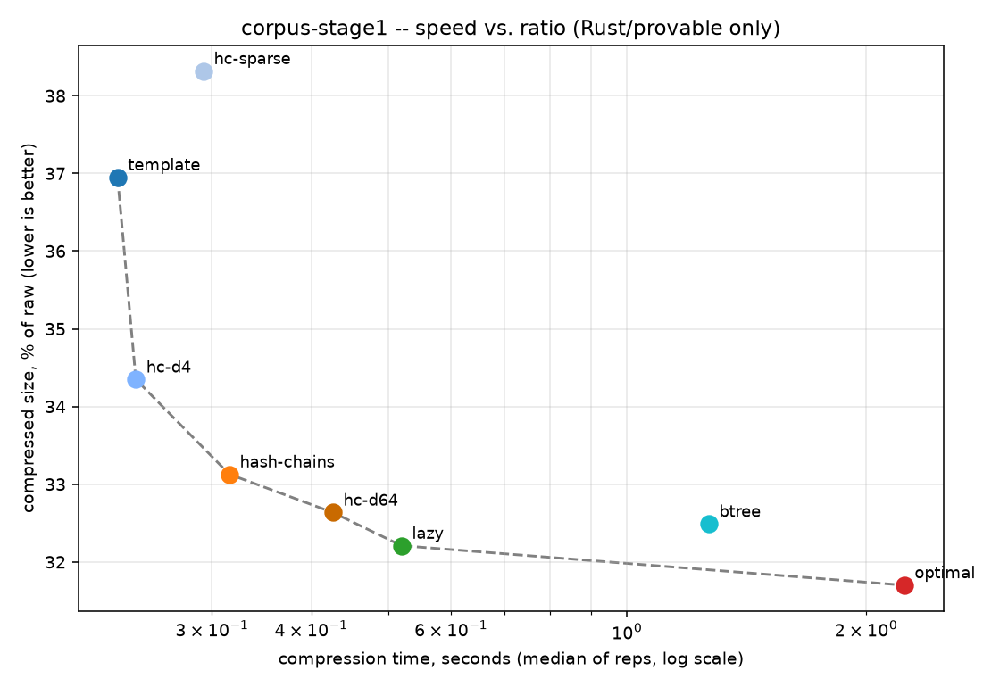
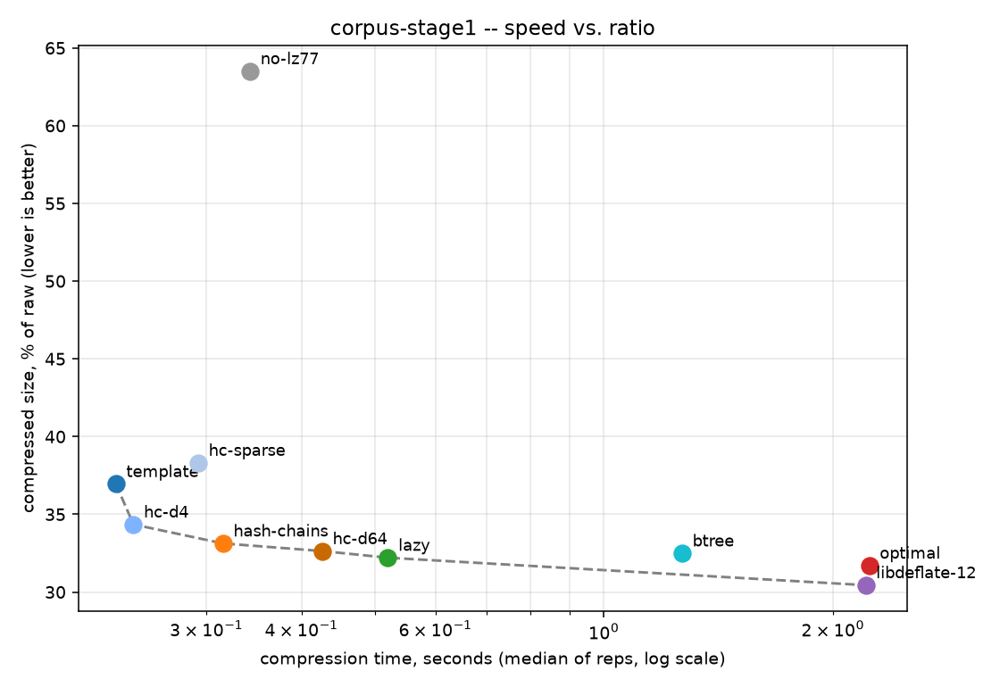
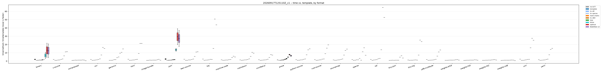
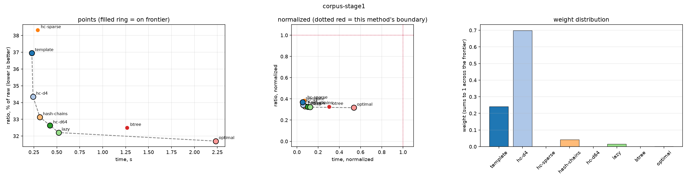
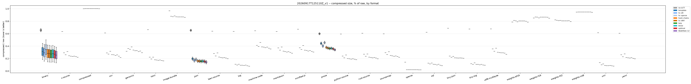

# Benchmark results — staged corpus

Ten LZ77 parse candidates, three corpora, one run. What this set out to answer:
does the staged corpus rank submissions the same way the old one did, does the
held-out stage agree with the public one, and is the speed floor still somewhere a
better parser can land.

| | |
|---|---|
| run | [`run-20260917T125110Z.jsonl`](run-20260917T125110Z.jsonl) (raw, every per-rep timing) |
| collected | 2026-09-17, 1 warmup + 5 measured rounds, round-robin across methods |
| host | AMD Ryzen 5 PRO 8540U, linux/x86_64, rustc 1.94.1 |
| corpora | `corpus-stage1` (28 files, 15.9 MB), `corpus-stage2` (28, 15.9 MB), `corpus-initial` (5, 8.1 MB) |
| methods | 8 provable Rust parsers, plus `no-lz77` and `libdeflate-12` as bounds |

Every candidate but `libdeflate-12` runs through this repository's own
`deflate::encode`, so ratios are comparable. `libdeflate-12` is a complete production
compressor with a different entropy stage — context for how much is left on the table,
not an apples-to-apples time comparison.

## 1. The headline: the two stages agree

This is the result the staged design lives or dies on. Absolute ratios shift by a
uniform ~0.55pp between stages — stage 2 happens to be slightly harder data — but the
competition scores a *ratio against the incumbent*, and that offset cancels almost
exactly:

| method | stage 1 | stage 2 | vs `lazy`, stage 1 | vs `lazy`, stage 2 | Δ |
|---|---|---|---|---|---|
| `no-lz77` | 63.51% | 64.06% | 1.97185 | 1.95550 | −0.0164 |
| `template` | 36.95% | 37.58% | 1.14718 | 1.14718 | **0.00000** |
| `hc-d4` | 34.35% | 34.96% | 1.06643 | 1.06703 | +0.0006 |
| `hc-sparse` | 38.32% | 38.87% | 1.18963 | 1.18654 | −0.0031 |
| `hash-chains` | 33.13% | 33.72% | 1.02853 | 1.02920 | +0.0007 |
| `hc-d64` | 32.64% | 33.21% | 1.01325 | 1.01361 | +0.0004 |
| `lazy` (incumbent) | 32.21% | 32.76% | 1.00000 | 1.00000 | — |
| `btree` | 32.49% | 33.07% | 1.00872 | 1.00954 | +0.0008 |
| `optimal` | 31.70% | 32.26% | 0.98423 | 0.98481 | +0.0006 |
| `libdeflate-12` | 30.44% | 31.00% | 0.94517 | 0.94612 | +0.0010 |

**Every provable candidate agrees between the stages to within 0.001**, and `template`
to five decimal places. Ordering is identical, and so is Pareto frontier membership.
A parser tuned on the public set is not walking into a different problem on the hidden
one — which is the whole requirement for a held-out set to be fair rather than merely
secret.

`no-lz77` is the one outlier at −0.016. It emits literals only, so its output tracks
raw entropy rather than match structure, and it is a bound rather than a candidate.

## 2. Pareto frontier



Among the eight provable parsers on `corpus-stage1`:

| method | ratio | bytes | time | frontier |
|---|---|---|---|---|
| `template` | 36.95% | 5,885,981 | 0.228s | **yes** |
| `hc-d4` | 34.35% | 5,471,650 | 0.241s | **yes** |
| `hc-sparse` | 38.32% | 6,103,815 | 0.293s | no |
| `hash-chains` | 33.13% | 5,277,229 | 0.316s | **yes** |
| `hc-d64` | 32.64% | 5,198,805 | 0.426s | **yes** |
| `lazy` | 32.21% | 5,130,834 | 0.520s | **yes** |
| `btree` | 32.49% | 5,175,558 | 1.267s | no |
| `optimal` | 31.70% | 5,049,908 | 2.233s | **yes** |

Six of eight are on it, and stage 2 agrees exactly. `hc-sparse` and `btree` are
dominated on every corpus tested — `hc-sparse` is beaten outright by `hc-d4`, and
`btree` gets `lazy`'s ratio for 2.4x the time.

One candidate moved. On `corpus-initial` the frontier was 5 of 8, with **`template`
dominated**: `hc-d4` was both smaller (29.21% vs 32.32%) *and* marginally faster
(0.1148s vs 0.1173s), so the simplest parser was strictly pointless. On the staged
corpus template is clearly the fast extreme (0.228s vs hc-d4's 0.241s) and returns to
the frontier. That is the more believable picture — a greedy single-probe parser
should be the cheapest thing on the board — and it suggests the old corpus was small
enough that the two were inside each other's timing noise.



One change worth naming. With `libdeflate-12` included, **`optimal` drops off the
frontier**: libdeflate reaches 30.44% in 2.208s against optimal's 31.70% in 2.233s, so
it now wins on both axes. On `corpus-initial` optimal was *faster* than libdeflate
(1.197s vs 1.215s) and so stayed on the frontier by a hair. This is a presentation
change, not a competitive one — libdeflate is not admissible — but it is an honest
signal that the provable frontier has less slack against production code here.

The gap to state of the art actually *narrowed*: `optimal` is 4.1% above libdeflate on
the new corpus against 5.1% on `corpus-initial`.

## 3. Speed, and the floor

The harness rejects anything slower than **8.0x the incumbent**. Measured against
`lazy` on `corpus-stage1`:

| method | time | vs `lazy` |
|---|---|---|
| `template` | 0.228s | 0.44x |
| `hash-chains` | 0.316s | 0.61x |
| `lazy` | 0.520s | 1.00x |
| `btree` | 1.267s | 2.44x |
| `optimal` | 2.233s | **4.29x** |

`optimal`, the best provable parser there is, sits at 4.3x of the incumbent in this
harness — comfortably inside the floor. (The scoring harness reports 5.5x for the same
pair; it takes the minimum of 11 reps per file rather than the median of 5, and
includes the round-trip decode, so its number is the stricter one. Both are well under
8.0x.)

Getting there took work. An earlier balance of the same manifest put `optimal` at
**7.6x** — 5% of headroom, enough that the next better-but-slower parser would have
been rejected on time rather than judged on bytes. Real logs and SQL dumps are so
redundant that optimal parsing costs 38x and 41x the incumbent on them for little
gain, while prose, markdown and C source buy more headroom at 3–5x. Re-weighting
toward the cheap discriminators fixed it and *raised* total headroom 16%.



Format-normalised, equal weight per format, `optimal` runs 14.7x ± 14.5 the time of
`template`. The ±14.5 is the point: the cost of optimal parsing is wildly
format-dependent, and a corpus that did not span formats would hide that.

## 4. Frontier weighting — who on the frontier is actually worth having

`scripts/pareto-weights.py` asks a question the frontier alone does not: of the points
on it, which ones *buy* something. It carries eight competing weight functions. It was
a synthetic-scenario spike; it now also takes `--run`, so the same eight can be pointed
at a real frontier:

```bash
.venv/bin/python scripts/pareto-weights.py --run --corpus corpus-stage1
```

The time boundary matters and is derived, not assumed. This competition enforces no
absolute time limit — it rejects anything slower than 8x the incumbent — so the
boundary is `8 x lazy = 4.159s` on this corpus. The script's 120s placeholder would
have pushed every real point (0.23–2.23s) into the corner and flattened every
normalized method into noise.

Weight assigned to each provable candidate on `corpus-stage1`:

| point | diag·33 | diag1 | diag3 | elbow | hv | hv-norm | loc-glob | neigh |
|---|---|---|---|---|---|---|---|---|
| `template` | 0.095 | 0.191 | 0.238 | 0.242 | 0.005 | 0.003 | 0.094 | **0.923** |
| `hc-d4` | 0.191 | **0.286** | **0.286** | **0.699** | 0.034 | 0.018 | 0.215 | 0.038 |
| `hash-chains` | **0.286** | 0.238 | 0.191 | 0.043 | 0.052 | 0.028 | 0.206 | 0.018 |
| `hc-d64` | 0.238 | 0.143 | 0.143 | 0.000 | 0.044 | 0.024 | 0.161 | 0.007 |
| `lazy` | 0.143 | 0.095 | 0.095 | 0.015 | **0.811** | 0.435 | **0.231** | 0.006 |
| `optimal` | 0.048 | 0.048 | 0.048 | 0.001 | 0.053 | **0.493** | 0.094 | 0.007 |
| `hc-sparse`, `btree` | 0 | 0 | 0 | 0 | 0 | 0 | 0 | 0 |

They disagree completely, and real data exposes two failure modes the spike's own
docstring predicted:

- **`hypervolume` gives `lazy` 81%.** Its documented flaw is that a point sitting just
  before a large empty gap inherits the whole gap. `lazy` is at 0.52s and the next
  frontier point is `optimal` at 2.23s, so `lazy` banks 1.7 seconds of emptiness that
  nothing reached. Normalizing against the enforced boundary redistributes it and
  flips the winner to `optimal` — a scoring function whose answer inverts under a
  change of units is not measuring the thing it claims to.
- **`neighbor-improvement` gives `template` 92%.** It compares the fastest point
  against `BOUNDARY_RATIO_PCT` = 100%, but nothing real is near 100% — even a
  literals-only parser reaches 63.5% — so `template` banks a 63-point "improvement"
  it never made.



`elbow-sweetspot` and the `diagonal-sweep` family agree on the defensible answer:
**`hc-d4` is the knee of this frontier**, the point where the steep initial drop
(36.9% → 34.3% for 5% more time) gives way to diminishing returns. That matches the
scatter directly. `optimal` gets little weight from every method except
`hypervolume-normalized` — it is the ratio champion, but it pays 4.3x the incumbent's
time to take the last 0.5 percentage points.

A caveat the plot makes obvious: in the normalized panel every real point sits at
≤0.55 on the time axis. The 8x speed floor is nowhere near binding for anything
currently submitted, so any method anchored to it is scoring against a boundary the
field has not approached.

## 5. Per-format behaviour



Equal-weighting the 24 format labels rather than pooling bytes:

| method | ratio (mean ± std across formats) |
|---|---|
| `no-lz77` | 66.29% ± 17.03 |
| `template` | 39.49% ± 28.09 |
| `hash-chains` | 36.57% ± 29.06 |
| `lazy` | 35.85% ± 29.33 |
| `optimal` | 35.49% ± 29.46 |
| `libdeflate-12` | 34.45% ± 29.40 |

The ±29 standard deviation across formats is the corpus doing its job: it spans 2.8%
to 94.8% compressibility, from `sparse.bin` through prose and source to quantized
model weights and already-compressed archives. `corpus-initial` spanned 12.5% to
40.2%, and a spread that narrow cannot tell you whether a parser generalises.

## 6. Against `corpus-initial`

| | `corpus-initial` | staged corpus |
|---|---|---|
| files / bytes | 5 / 8.1 MB | 28 / 15.9 MB |
| compressibility span | 12.5% – 40.2% | 2.8% – 94.8% |
| `optimal` vs incumbent | 0.98224x | 0.98423x |
| `optimal` vs libdeflate | +5.1% | +4.1% |
| provable frontier | 5 of 8 | 6 of 8 |
| dominated | `template`, `hc-sparse`, `btree` | `hc-sparse`, `btree` |

The ordering of candidates is preserved throughout; the only structural change is
`template` rejoining the frontier, discussed above. The margin is slightly compressed
— 1.58% against 1.78%
— because 14% of the new corpus is near-incompressible and the score is a pooled byte
ratio. Byte counts are exact rather than sampled, so this costs display range, not
resolution.

## 7. Coverage against an external reference

`scripts/corpus-coverage.py` measures whether the manifest spans the parse behaviour
real data shows, over six measured axes rather than over format names. Silesia is the
reference, being what modern compressors report against.

- **worst reach 0.161**, on `osdb` — no Silesia file behaves in a way nothing in the
  benchmark tests. Mean 0.091.
- `mozilla`, Silesia's binary/executable file, went from 0.125 to **0.066** when
  WebAssembly was added; that addition was made because the metric flagged the hole.
- Two candidate parts were built and rejected by it: a `.docx` part at 0.035 from
  `images.bin`, and a second GGUF quantization at 0.002 from the first.

The full taxonomy, the list of data types that are *not* here, and the two places the
metric is deliberately overruled are in [CORPUS-SOURCES.md](../../CORPUS-SOURCES.md).

## Reproducing

```bash
just corpus-sources                      # ~900 MB pool (once)
just corpus-verify                       # present, and still cuts stage 1 byte-identically
VERIFY_CORPUS=corpus-stage1 just bench      # then again with corpus-stage2, corpus-initial
just bench-report                          # per-format report, Pareto front, stability
.venv/bin/python scripts/pareto-weights.py --run   # frontier weighting, 8 methods
just corpus-coverage                     # reach and spacing against Silesia
```

Collection and analysis are separate on purpose: the run file keeps every raw per-rep
timing and nothing pre-aggregated, so the analysis can be reworked without re-running
the slow part.

> **Note on reproducing this run.** It was collected with `scripts/pareto-bench`, the
> unsandboxed collector that `validator/measure` and `python -m bench` have since
> replaced. The commands above are the current equivalents; the numbers are the ones
> the retired path produced, and `just bench-compare` is what checks a fresh run
> against them.
